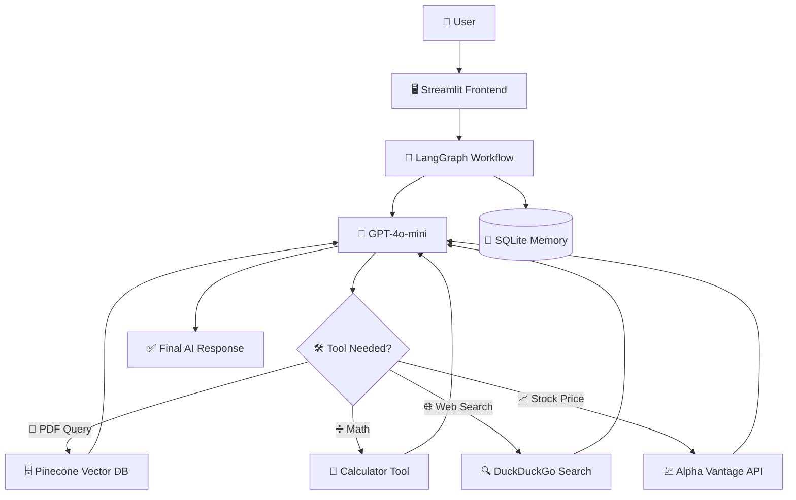
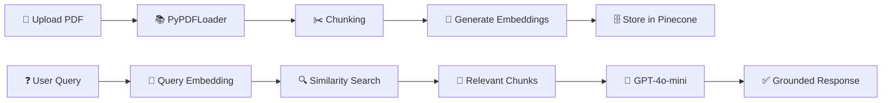
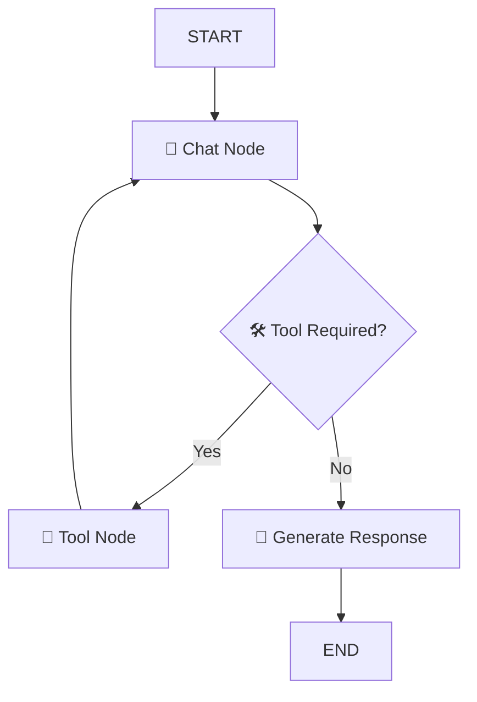

# 🚀 LangGraph RAG Multi-Utility AI Chatbot

<div align="center">


<br>


### 🧠 Production-Style AI Chatbot using LangGraph + RAG + Pinecone + OpenAI

</div>

---

# 📌 Overview

This project is a **production-style AI chatbot system** built using:

- LangGraph
- LangChain
- OpenAI
- Pinecone
- SQLite
- Streamlit

The chatbot can:

✅ Understand uploaded PDFs  
✅ Perform semantic document retrieval  
✅ Maintain persistent conversation memory  
✅ Dynamically call external tools  
✅ Search the web in real time  
✅ Fetch live stock prices  
✅ Handle multiple chat sessions  
✅ Stream responses in real time  

---

# 🏗️ System Architecture



---

# 🧠 Core Features

---

## 📄 Retrieval Augmented Generation (RAG)

The chatbot uses RAG architecture for document question-answering.

### Workflow:

1️⃣ Upload PDF  
2️⃣ Extract text using PyPDFLoader  
3️⃣ Split text into chunks  
4️⃣ Generate embeddings  
5️⃣ Store vectors in Pinecone  
6️⃣ Perform semantic retrieval  
7️⃣ Generate grounded responses  

---

## 🧵 Multi-Thread Chat System

Each conversation gets a unique `thread_id`.

This allows:

- Independent conversations
- Separate retrievers
- Separate memory states
- Separate document contexts

---

## 🧠 Persistent Memory

Conversation memory is stored using SQLite checkpointing.

Stored information includes:

- Chat history
- Workflow states
- Tool execution states
- Graph checkpoints

---

## 🛠️ Dynamic Tool Calling

The AI agent dynamically decides whether to:

- Answer directly
- Retrieve PDF content
- Search the web
- Perform calculations
- Fetch stock prices

---

## ⚡ Real-Time Streaming Responses

Implemented token-level streaming for:

- Better user experience
- Faster perceived responses
- Interactive chatbot behavior

---

# ⚙️ Tech Stack

| Category | Technology |
|---|---|
| Frontend | Streamlit |
| Workflow Engine | LangGraph |
| LLM Framework | LangChain |
| LLM | GPT-4o-mini |
| Embeddings | text-embedding-3-small |
| Vector Database | Pinecone |
| Memory Database | SQLite |
| Search Tool | DuckDuckGo |
| External API | Alpha Vantage |
| Language | Python |

---

# 🔍 RAG Pipeline



---

# 🧠 Why Pinecone?

Pinecone was used because it provides:

✅ Fast vector similarity search  
✅ Scalable cloud-native architecture  
✅ Low-latency retrieval  
✅ Efficient semantic search  
✅ Production-ready vector indexing  

---

# 🧠 Why LangGraph?

LangGraph was used to build:

- Stateful AI workflows
- Conditional execution flows
- Multi-step reasoning systems
- Dynamic tool orchestration
- Persistent conversational agents

Instead of simple sequential chains, LangGraph enables graph-based AI agent execution.

---

# 🤖 LLM Used

## GPT-4o-mini

Used for:

- User intent understanding
- Response generation
- Tool calling decisions
- Conversation management

---

# 🧬 Embedding Model Used

## text-embedding-3-small

Used for generating vector embeddings for semantic similarity search.

---

# 🛠️ Tools Implemented

---

## 📄 RAG Tool

Custom retrieval tool for document QA.

Responsibilities:

- Retrieve relevant chunks
- Return contextual information
- Enable grounded responses

---

## 🧮 Calculator Tool

Supports:

- Addition
- Subtraction
- Multiplication
- Division

---

## 🌐 Web Search Tool

Uses DuckDuckGo for real-time internet search.

---

## 📈 Stock Price Tool

Integrated Alpha Vantage API for live stock prices.

---

# 📂 Project Structure

```bash
📦 LangGraph-RAG-Chatbot
│
├── frontend.py
├── backend.py
├── requirements.txt
├── chatbot.db
├── .env
│
└── README.md
```

---

# ⚡ LangGraph Workflow



---

# 🖥️ Frontend Features

✅ Chat-style interface  
✅ PDF upload functionality  
✅ Sidebar thread management  
✅ Conversation switching  
✅ Streaming responses  
✅ Tool execution indicators  
✅ Multi-chat session handling  

---

# 🔐 Production-Level Design

This project was intentionally designed with production mindset:

- Modular architecture
- Thread isolation
- Persistent checkpointing
- Dynamic workflow routing
- Reusable retrieval functions
- Stateful execution
- Error handling
- Temporary file cleanup

---


# 🚀 Installation

---

## 1️⃣ Clone Repository

```bash
git clone https://github.com/yourusername/langgraph-rag-chatbot.git

cd langgraph-rag-chatbot
```

---

## 2️⃣ Install Dependencies

```bash
pip install -r requirements.txt
```

---

## 3️⃣ Create `.env` File

```env
OPENAI_API_KEY=your_openai_key

PINECONE_API_KEY=your_pinecone_key

ALPHA_VANTAGE_API_KEY=your_alpha_vantage_key
```

---

## 4️⃣ Run Application

```bash
streamlit run frontend.py
```

---

# 📚 Concepts Used

- Retrieval Augmented Generation (RAG)
- Vector Databases
- Semantic Search
- AI Agents
- LangGraph Workflows
- Tool Calling
- Stateful AI Systems
- Persistent Memory
- Embeddings
- Streaming Responses

---

# 🚀 Future Improvements

- 🔐 User Authentication
- 📄 Multi-PDF Retrieval
- 🎤 Voice Assistant
- 🧠 OCR Support
- ⚡ Redis Caching
- 🐳 Docker Deployment
- ☸️ Kubernetes Scaling
- 📊 LangSmith Monitoring

---

# 🎯 Final Summary

This project helped me understand how real-world AI systems are built using:

✅ RAG pipelines  
✅ Vector databases  
✅ AI agent workflows  
✅ Persistent memory systems  
✅ Tool calling architectures  
✅ Stateful AI orchestration  

Instead of building a simple chatbot, the main focus was to design a scalable and production-oriented AI assistant.

---

<div align="center">

# ⭐ If You Like This Project, Give it a Star ⭐

</div>